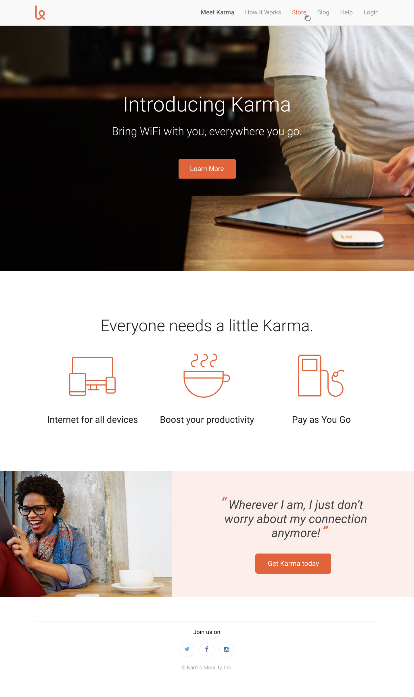
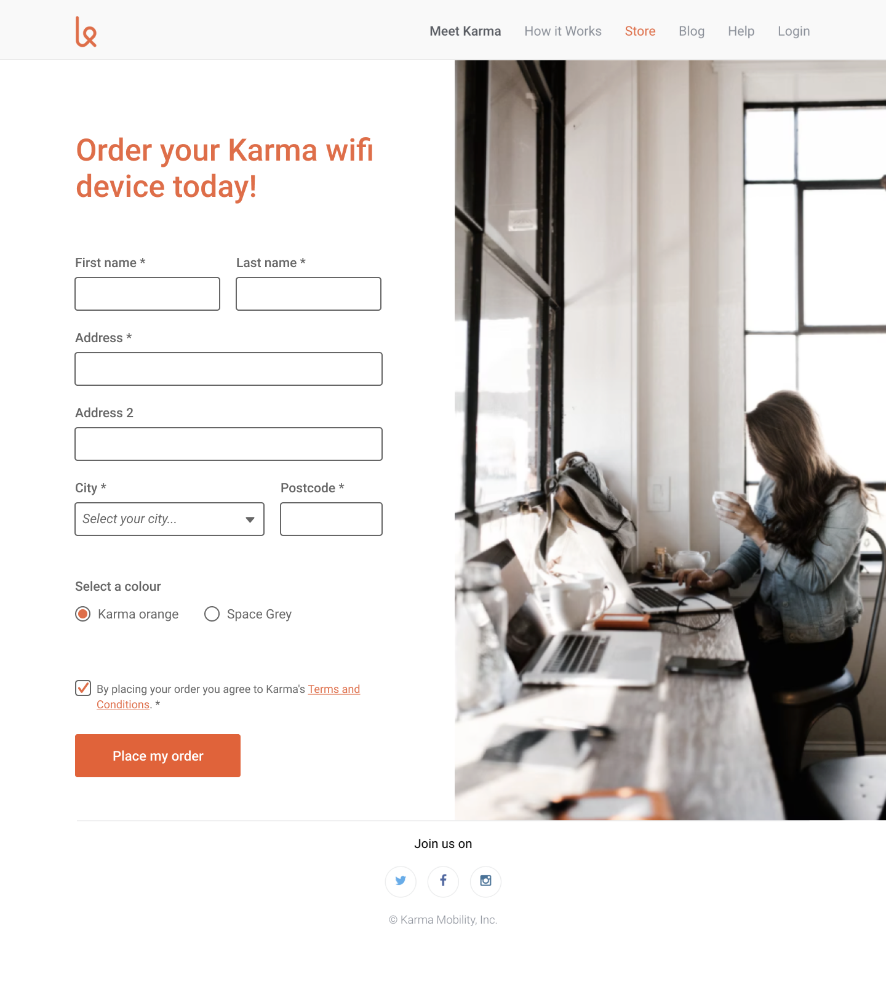

# karma-clone
## Level 2
The aim of this exercise is to:
-  add a new section to the homepage
-  create a new 'store' page with an order form
-  connect the 2 pages together by adding navigation

# Instructions

- You'll find the designs inside the 'level-2' folder.
- Add the new section in your `index.html`
- Create a new page called `store.html` and re-create the design for the store page (the design is `level-2/store-desktop.png`)
- For the store page styles, you can keep using the same `style.css` file and add your store page styles in there.
You could also create a specific `store.css` file - just make sure you're not duplicating the CSS already defined in `style.css`! 
- Connect the 2 pages by:
  - making the homepage's "Get Karma today" button navigate to the store page.
  - making the header navigation "Store" link navigate to the store page, and the "Meet Karma" link navigate to the homepage.

**Stretch goal**
- Custom radio buttons and checkbox: the 2 radio buttons and the checkbox in the store page design are tricky to style and will require you to do a little research. Focus on the rest of the form and layout first, and leave these until the end as a stretch goal.

### Submitting your work
 - Remember to **commit and push your code often**
 - Once you're ready to submit your homework for review, do a final push and **create a Pull Request**. If you're unsure how to do this, [have a look here](https://syllabus.codeyourfuture.io/git/cheatsheet/#i-want-to-send-my-code-to-volunteers-pushing).
 **Note:** If you've added your level 2 code to the same branch, then it will just update your previous Pull Request and you won't need a new PR.

## Designs

