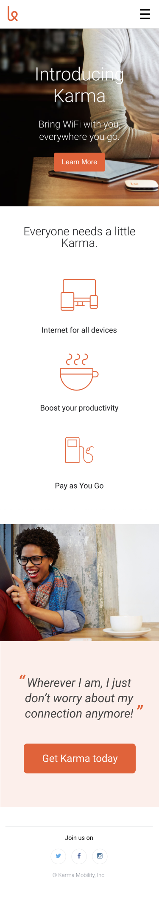
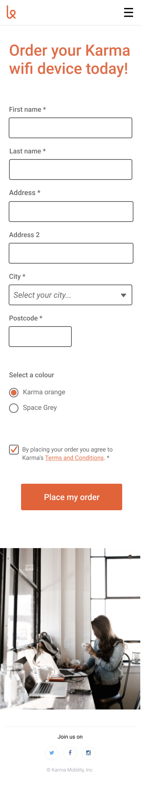

# karma-clone
## Level 3

Now let's make this website responsive! 

# Instructions

- Use media queries to make both the homepage and the order page look good on mobile. 
- You'll find the mobile designs inside the 'level-3' folder. 
- You can use 1 or 2 breakpoints, it's up to you (if you're not sure, start with 768px - it's a classic one as it's the width of an iPad and a good point to switch from a mobile layout to a desktop layout).
- You might have to change some of your existing HTML and CSS code so that your webpage can match the mobile and desktop designs

### Submitting your work
 - Remember to **commit and push your code often**
 - Once you're ready to submit your homework for review, do a final push and **create a Pull Request**. If you're unsure how to do this, [have a look here](https://syllabus.codeyourfuture.io/git/cheatsheet/#i-want-to-send-my-code-to-volunteers-pushing).
 **Note:** If you've added your level 3 code to the same branch you used for the previous levels, then it will just update your existing Pull Request and you won't need a new PR. 

## Designs

